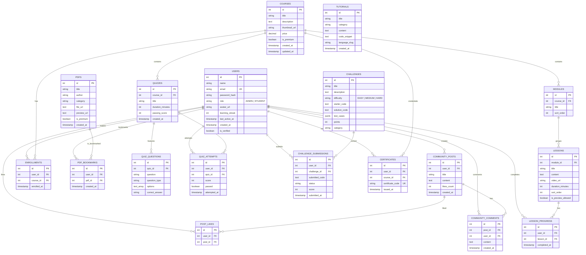

# Entity-Relationship Diagram (ERD)

Below is the structured entity logical design for the PowerCode Academy relational platform:

```mermaid
erDiagram
    USERS {
        int id PK
        string name
        string email UK
        string password_hash
        string role "ADMIN | STUDENT"
        string avatar_url
        int learning_streak
        timestamp last_active_at
        timestamp created_at
        boolean is_verified
    }
    
    COURSES {
        int id PK
        string title
        text description
        string thumbnail_url
        decimal price
        boolean is_premium
        timestamp created_at
        timestamp updated_at
    }

    MODULES {
        int id PK
        int course_id FK
        string title
        int sort_order
    }

    LESSONS {
        int id PK
        int module_id FK
        string title
        text content
        string video_url
        int duration_minutes
        int sort_order
        boolean is_preview_allowed
    }

    ENROLLMENTS {
        int id PK
        int user_id FK
        int course_id FK
        timestamp enrolled_at
    }

    LESSON_PROGRESS {
        int id PK
        int user_id FK
        int lesson_id FK
        timestamp completed_at
    }

    TUTORIALS {
        int id PK
        string title
        string category
        text content
        text code_snippet
        string language_slug
        timestamp created_at
    }

    PDFS {
        int id PK
        string title
        string author
        string category
        text file_url
        text preview_url
        boolean is_premium
        timestamp created_at
    }

    PDF_BOOKMARKS {
        int id PK
        int user_id FK
        int pdf_id FK
        timestamp created_at
    }

    QUIZZES {
        int id PK
        int course_id FK
        string title
        int duration_minutes
        int passing_score
        timestamp created_at
    }

    QUIZ_QUESTIONS {
        int id PK
        int quiz_id FK
        string question
        string question_type
        text_array options
        string correct_answer
    }

    QUIZ_ATTEMPTS {
        int id PK
        int user_id FK
        int quiz_id FK
        int score
        boolean passed
        timestamp attempted_at
    }

    CHALLENGES {
        int id PK
        string title
        text description
        string difficulty "EASY | MEDIUM | HARD"
        text starter_code
        text solution_code
        jsonb test_cases
        int points
        string category
    }

    CHALLENGE_SUBMISSIONS {
        int id PK
        int user_id FK
        int challenge_id FK
        text submitted_code
        string status
        int score
        timestamp submitted_at
    }

    CERTIFICATES {
        int id PK
        int user_id FK
        int course_id FK
        string certificate_code UK
        timestamp issued_at
    }

    COMMUNITY_POSTS {
        int id PK
        int user_id FK
        string title
        text content
        int likes_count
        timestamp created_at
    }

    COMMUNITY_COMMENTS {
        int id PK
        int post_id FK
        int user_id FK
        text content
        timestamp created_at
    }

    POST_LIKES {
        int id PK
        int user_id FK
        int post_id FK
    }

    USERS ||--o{ ENROLLMENTS : "makes"
    USERS ||--o{ LESSON_PROGRESS : "completes"
    USERS ||--o{ PDF_BOOKMARKS : "bookmarks"
    USERS ||--o{ QUIZ_ATTEMPTS : "attempts"
    USERS ||--o{ CHALLENGE_SUBMISSIONS : "submits"
    USERS ||--o{ CERTIFICATES : "receives"
    USERS ||--o{ COMMUNITY_POSTS : "creates"
    USERS ||--o{ COMMUNITY_COMMENTS : "comments"
    USERS ||--o{ POST_LIKES : "likes"

    COURSES ||--o{ MODULES : "contains"
    COURSES ||--o{ ENROLLMENTS : "has"
    COURSES ||--o{ CERTIFICATES : "credentials"
    COURSES ||--o{ QUIZZES : "contains"

    MODULES ||--o{ LESSONS : "groups"
    LESSONS ||--o{ LESSON_PROGRESS : "has"

    PDFS ||--o{ PDF_BOOKMARKS : "is_bookmarked"
    QUIZZES ||--o{ QUIZ_QUESTIONS : "features"
    QUIZZES ||--o{ QUIZ_ATTEMPTS : "attempted"
    CHALLENGES ||--o{ CHALLENGE_SUBMISSIONS : "solved"

    COMMUNITY_POSTS ||--o{ COMMUNITY_COMMENTS : "has"
    COMMUNITY_POSTS ||--o{ POST_LIKES : "liked"
```
